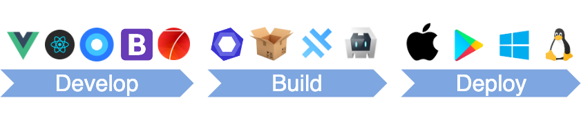

# App Framework

A combination of great pieces of open source code to let you develop, build and deploy a new application in minutes. With App Framework, you can spend your time for what makes your application unique, not the tricky stuff around!

## Features

- [ ] **Powerful JavaScript Framework** - based on [Vue.js](https://vuejs.org/) or [React](https://reactjs.org/).
- [ ] **Beautiful UX Framework** - choose [Framework7](https://framework7.io/), [Bootstrap](https://getbootstrap.com/) or [Material Design](https://material.io/design/).
- [ ] **Comprehensive Icon Fonts** - like [FontAwesome](http://fontawesome.io/), [Framework7 Icons](http://framework7.io/icons/), [Ion Icons](http://ionicons.com/) and [Material Design Icons](https://material.io/icons/).
- [ ] **Hardware APIs** - provided by [Capacitor](https://capacitor.ionicframework.com/) and [Cordova](https://cordova.apache.org/).
- [ ] **One Code Base** - with HTML, CSS and JavaScript with ES6 support.
- [ ] **Local Development Server** - with live reload, perfectly to use together with [Chrome DevTools](https://developers.google.com/web/tools/chrome-devtools/).
- [ ] **Native Build** - as [PWA](https://developers.google.com/web/progressive-web-apps/), mobile App (iOS or Android) or desktop App (macOS, Windows or Linux).
- [ ] **Easy Deployment** - without downtime, to the Apple App Store, Google Play Store, [Firebase](https://firebase.google.com/products/hosting/) or any FTP server.

&nbsp;

## Quick Start

Run `npx app-framework` to open a wizard which will guide you to your new application project. 

## Documentation

Preparation

- [Setup your Development Environment]()
- [Create your new Application Project]()

Development

- [Use Images]()
- ...
  
Deployment

- [Deploy your Application to an FTP Server]()
- [Deploy your Application to Google Firebase]()
- [Deploy your Application to the Apple App Store]()
- [Deploy your Application to the Google Play Store]()
- [Build your Application for macOS]()
- [Build your Application for Windows]()
- [Build your Application for Linux]()

Contribution

- [App Framework Architecture]()
- [Contribute to App Framework]()
