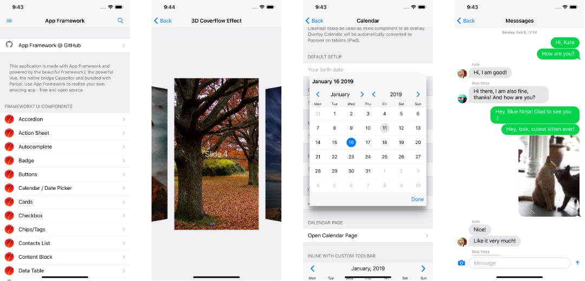

# App Framework

> This version 3 is still under development. You may use [version 1](https://github.com/scriptPilot/app-framework/tree/v1) instead.

**iOS and Android Apps with HTML & JavaScript. App Framework combines great pieces of open source code to support your whole workflow with useful scripts and your App with powerful plugins. With App Framework, you can spend your time for your next amazing App and not for the tricky stuff around - free and open source!**

## Features

**Core**

- [x] **Beautiful User Interface** with native iOS and Material Design elements and transitions, based on [Framework7](https://framework7.io/)
- [x] **Flexible Routing** for pages, tabs, modals and panels with dynamic routing support, realized with [Framework7-Vue](https://framework7.io/vue/navigation-router.html)
- [ ] **Multi-language Support** with language files and automatic completeness checks according the default language
- [x] **Offline Capability** to use the app even without any network connection
- [x] **One Code Base** for all devices with HTML, CSS and JavaScript, realized with [Capacitor](https://capacitor.ionicframework.com/), supporting [ES2015](https://babeljs.io/learn-es2015/)
- [x] **Single File Components** for powerful but easy to maintain apps, made with [Vue.js](https://vuejs.org/) and [Framework7-Vue](http://framework7.io/vue/)
- [x] **Project Folder Creation**, lightweight and well-organized, ready to publish on [GitHub](https://github.com/about)

**Scripts**

- [x] **Live Development Server** with hot module replacement, powered by [Parcel](https://parceljs.org/)
- [x] **Test on your own Device** or in any iOS or Android emulator, supported by [Capacitor](https://capacitor.ionicframework.com/), [Xcode](https://developer.apple.com/xcode/) and [Android Studio](https://developer.android.com/studio)
- [x] **Test Framework** for code correctness and standard conformity with [ESLint](http://eslint.org/) and for unit tests with [Jest](https://facebook.github.io/jest/)
- [x] **Optimized Build Process** for good scores at [Google Lighthouse](https://developers.google.com/web/tools/lighthouse/), realized with [Parcel](https://parceljs.org/)
- [ ] **Icon Generation** for favicons, touch icons and splash screens, out of a single image file with [Jimp](https://github.com/oliver-moran/jimp)
- [x] **Easy Deployment** without downtime to [Apple App Store](https://developer.apple.com/xcode/), [Google Play Store](https://developer.android.com/studio), [Firebase Hosting](https://firebase.google.com/products/hosting/) or any FTP server

**Plugins**

- [x] **Native Hardware API Plugins** for iOS and Android devices, realized with [Capacitor](https://capacitor.ionicframework.com/)
- [ ] **Comprehensive Icon Fonts** like [FontAwesome](http://fontawesome.io/), [Framework7 Icons](http://framework7.io/icons/), [Ion](http://ionicons.com/) and [Material Design Icons](https://material.io/icons/) out of the box
- [ ] **Phone Frame** around your application on big screens, so you can offer desktop access with charm
- [ ] **State Restoration** for the history per view, tabs, scroll positions, focus, panels, modals and form inputs
- [ ] **Global Data Object** to save user data across several application restarts easily
- [ ] **Vuex Integration** to use the official Vue.js [state management library](https://vuex.vuejs.org/en/intro.html)
- [ ] **Preloading** for images, fonts and JavaScript files
- [ ] **Firebase Integration** for several services like [Authentication](https://firebase.google.com/products/auth/), [Realtime Database](https://firebase.google.com/products/realtime-database/), [Firestore](https://firebase.google.com/products/firestore/) and [Cloud Storage](https://firebase.google.com/products/storage/)

## Demo App

The Apple App Store app may be outdated because Apple blocks demo apps from their store now.

&nbsp;&nbsp;&nbsp;

&nbsp;&nbsp;&nbsp;

## Documentation

### Quick Start

### Workflow

- Setup your development environment
- Start your new app project with App Framework
- Develop your application
  - Use CSS style sheets
  - Use image files
  - Use hardware API plugins
- Test your application
- Deploy your application

### CLI Reference

- Run `npx app test` to run all configured tests
- Run `npx app test` eslint to run ESLint test
- Run `npx app test` jest to run Jest tests
- Run `npx app dev` to open application on development server
- Run `npx app build` to build application according configuration
- Run `npx app deploy ftp` to deploy the PWA to any FTP server
- Run `npx app deploy firebase` to deploy the PWA to any FTP server
