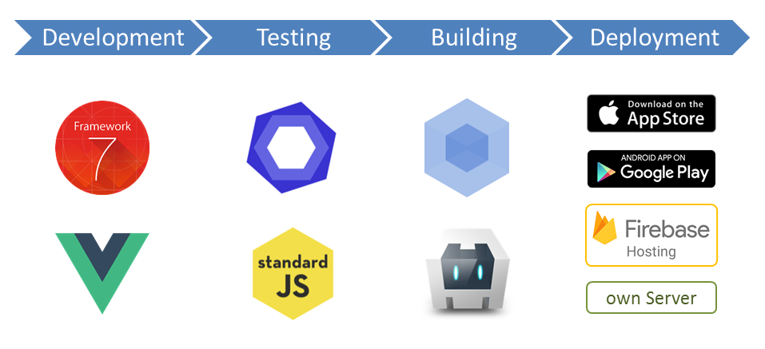

# App Framework &nbsp; &nbsp; &nbsp;   

> Does all the tricky stuff for you, to develop, build and deploy iOS and Android Apps - for free and open source!

### Setup

- Creation of a lightweight and well-organized project folder, prepared to push to [GitHub](https://github.com/about)
- [Demo App](https://app-framework.scriptpilot.de/) to use as base for your own application with typical use cases

### Design

- Printable templates to design your application with paper and pencil

### Development

- Realize beautiful user interfaces with all well-known components and typical transitions, based on [Framework7](https://framework7.io/), for [iOS](http://framework7.io/kitchen-sink-ios/) and [Material](http://framework7.io/kitchen-sink-material/)
- Make your user interface state-based and reactive with the power and simplicity of [Vue.js](https://vuejs.org/)
- Save time with reusable components, powered by [Framework7-Vue components](https://framework7.io/vue/)
- Comprehensive icon fonts out of the box like [FontAwesome](http://fontawesome.io/), [Framework7](http://framework7.io/icons/), [Ion](http://ionicons.com/) and [Material Icons](https://material.io/icons/)
- Easy to maintain single file components, based on 
- One code base for all devices with HTML, CSS and JavaScript - realized with [Cordova](https://cordova.apache.org/)
- Well prepared to use [Firebase Authentication](https://firebase.google.com/docs/auth/), [realtime database](https://firebase.google.com/docs/database/) and [storage services](https://firebase.google.com/docs/storage/)

Easy integration of Firebase User registration, password reset and login processes with [Firebase Authentication]()
- [Realtime database]() and [file storage]() services with Firebase

### Testing

- Integrated code checks for [correctness](http://eslint.org/) and [standard conformity](http://standardjs.com/)

### Building

### Deployment

- Deployment without downtime
  - To your own server or web space
  - To the [Firebase Hosting service](https://firebase.google.com/docs/hosting/)
  - To the [Apple App Store](https://itunes.apple.com/de/)
  - To the [Google Play Store](https://play.google.com/)
- Easy rollback solution

---

## Features
> The power is under the hood - but for sure, we have a [Demo App](https://app-framework.scriptpilot.de/).

**Beautiful**
- All well known 

- Phone frame around your application on big screens

**Powerful**

- 
- State kept for history, tabs, scroll positions, panels, modals, form and page component data
- User registration, password reset and login processes with [Firebase Authentication](https://firebase.google.com/docs/auth/)
- [Realtime database](https://firebase.google.com/docs/database/) and [file storage](https://firebase.google.com/docs/storage/) services with Firebase

- Offline capabilty, flexible routing and multi-language support

**Timesaving**

- 
- Development server with live reload, perfectly to use together with [Chrome DevTools](https://developers.google.com/web/tools/chrome-devtools/) 
- Your application is splitted up in easy to maintain [single file components](https://vuejs.org/v2/guide/single-file-components.html) with [ES2015 support](https://babeljs.io/learn-es2015/)
- Generation of favicons, touch icons and splash screens out of a single image file
- Build process with version bump and compression of all HTML, CSS, JavaScript and image files
- Deployment to [Firebase Hosting](https://firebase.google.com/docs/hosting/) or your own server without downtime and with easy rollback solution

## Quick start

1. Install [Node.js with npm](https://docs.npmjs.com/getting-started/what-is-npm)
2. Download *[package.json](https://raw.githubusercontent.com/scriptPilot/app-framework/master/demo-app/package.json)* file to an empty folder (keep extension .json!)
3. Run `npm install` to setup the project folder
4. Run `npm run dev` to start the Demo App at localhost:8080
5. Read our [Documentation](DOCUMENTATION.md)
