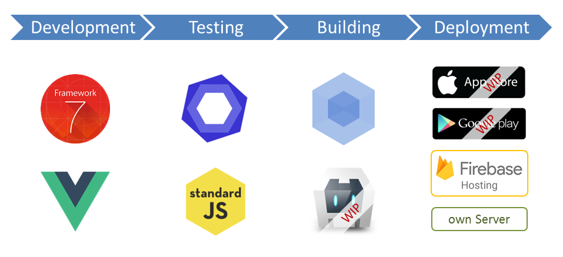
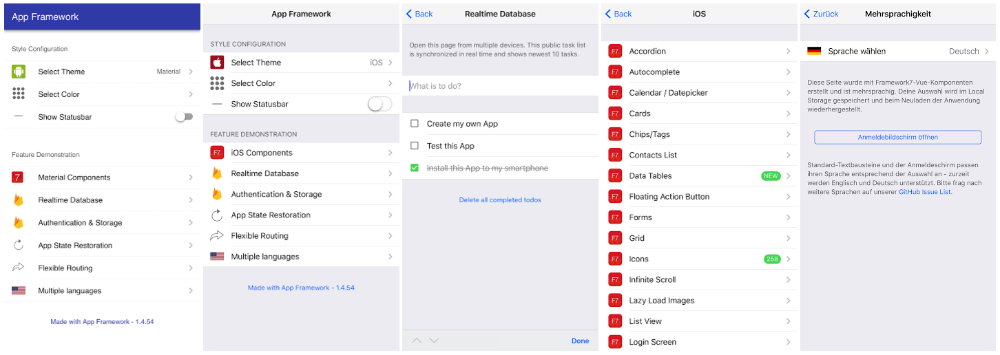

# App Framework &nbsp; &nbsp; &nbsp;   

**iOS and Android Apps with HTML & JavaScript - App Framework combines great pieces of open source code to support your whole workflow with useful scripts and your app with powerful plugins. With App Framework, you could spend your time for your next amazing App and not for the tricky stuff around - free and open source!**

## Features

Setup your project:

- Creation of a lightweight and well-organized project folder, ready to publish on [GitHub](https://github.com/about)

Design your application:

- Printable [template](design/smartphone-template.pdf) to design your application with paper and pencil
- Templates for your icon design - as [PDF for sketching](design/icon-template.pdf) and [PPTX](design/icon-template.pptx) for drawing

Develop your application:s

- Realize beautiful user interfaces with all well-known components and transitions, based on [Framework7](https://framework7.io/)
- Easy to maintain [single file components](https://vuejs.org/guide/single-file-components) with [reusable UI elements](https://framework7.io/vue/), based on [Vue.js](https://vuejs.org/)
- One code base for all devices with HTML, CSS and JavaScript - realized with [Cordova](https://cordova.apache.org/), supporting [ES2015](https://babeljs.io/learn-es2015/)
- Comprehensive icon fonts like [FontAwesome](http://fontawesome.io/), [Framework7](http://framework7.io/icons/), [Ion](http://ionicons.com/) and [Material Icons](https://material.io/icons/) out of the box
- Well prepared to use [Firebase authentication](https://firebase.google.com/products/auth/), [realtime database](https://firebase.google.com/products/database/) and [storage services](https://firebase.google.com/products/storage/)
- State kept for history, tabs, scroll positions, focus, panels, modals, form inputs and page component data
- Global persistent data object to use the same data and setting across your whole application
- [Flexible routing](http://framework7.io/vue/navigation-router.html) with dynamic, nesting and login protection
- Offline capability, image preloading and multi-language support out of the box

Test your application:

- Integrated configurable code check and fix with [ESLint](http://eslint.org/), based on [Airbnb](https://github.com/airbnb/javascript) or [Standard JavaScript](http://standardjs.com/)
- Local development server with live reload, perfectly to use together with [Chrome DevTools](https://developers.google.com/web/tools/chrome-devtools/)
- Test your application on any iOS or Android device with an emulator or on your own device
- Use a development Firebase project with automatic [database](https://firebase.google.com/products/database/) and [storage](https://firebase.google.com/products/storage/) rule update

Build your application:

- Build process with version bump and compression of all HTML, CSS, JavaScript and image files
- Generation of favicons, touch icons and splash screens out of a single image file
- Phone frame around your application on big screens, so you can offer desktop access with charm
- Automatic build as web application, to be used online and offline in the browser
- Automatic [Apple Xcode](https://developer.apple.com/xcode/) project build with [Cordova](https://cordova.apache.org/)
- Automatic [Android Studio](https://developer.android.com/studio) project build with [Cordova](https://cordova.apache.org/)
- App Framework builds score very good at performance tests like [Google Lighthouse](https://developers.google.com/web/tools/lighthouse/) or [YSlow](http://yslow.org/)

Deploy your application:

- Deployment without downtime
  - to any FTP server as Web App
  - to the [Firebase Hosting service](https://firebase.google.com/products/hosting/) as Web App
  - to the [Apple App Store](https://itunes.apple.com/) as native iOS App
  - to the [Google Play Store](https://play.google.com/) as native Android App
- Easy rollback solutions

Backup your project:

- Download the [Firebase database content](https://firebase.google.com/products/database/) and [user list](https://firebase.google.com/products/auth/) to local JSON files
- Snapshot creation of all important project files to backup on any external drive or cloud service

## Documentation

## Demo App

&nbsp;&nbsp;&nbsp;

&nbsp;&nbsp;&nbsp;

