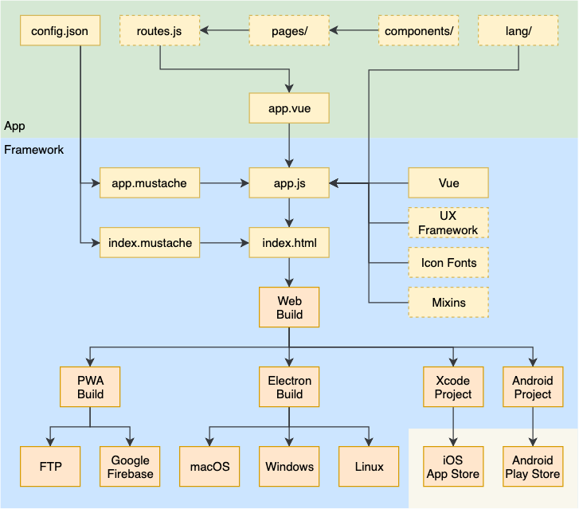

# Architecture

## Build Flow



## Folder Structure

```
├── .git/                    # Git managed folder (do not modify)
├── app/                     # App files
|   ├── components/          # App components (optional)
|   ├── lang/                # App language files (optional)
|   ├── pages/               # Framework7-Vue single file components (optional)
|   ├── app.vue              # App component file
|   └── routes.json          # Framework7-Vue routes file (optional)
├── build/                   # Latest build files (do not modify)
├── cache/                   # Cache folder (do not modify)
├── docs/                    # Documentation files
|   └── images/              # Documentation image files
├── framework/               # App Framework core files
|   ├── mixins/              # Vue mixins
|   ├── scripts/             # Scipts (composed by the CLI)
|   ├── app.mustache         # app.js mustache template
|   ├── cli.js               # CLI program
|   ├── configSchema.json    # App config schema
|   └── index.mustache       # index.html mustache template
├── .eslintrc.json           # ESLint default configuration
├── .gitignore               # Gitignore config file
├── CHANGELOG.md             # Release changelog
├── LICENSE                  # App Framework license file
├── package.json             # App Framework project information
└── README.md                # Documentation entry page
```

All other folder and files are temporary and/or system files and not mentioned to be published.
