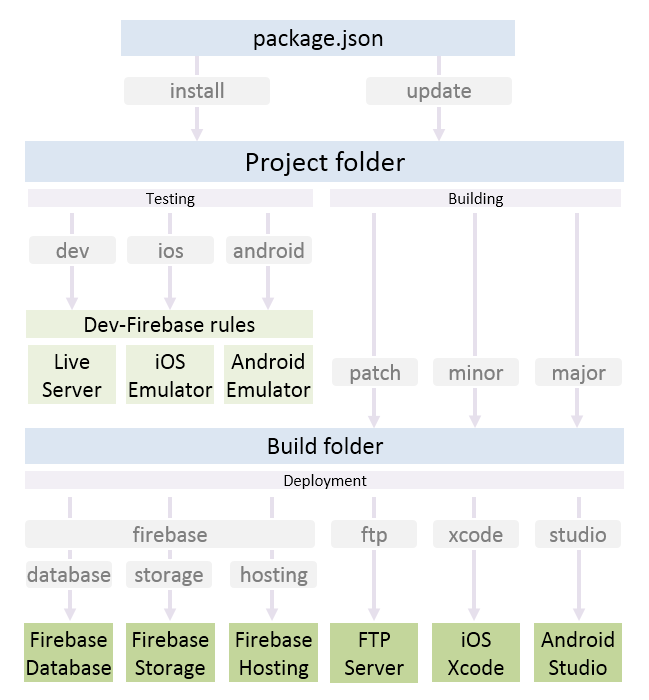

# CLI commands

> This page is part of the [App Framework Documentation](../DOCUMENTATION.md)

 

- Setup
  - `npm install` to install App Framework and setup the project folder
  - `npm update` to update App Framework to the latest sub version

- Testing
  - `npm run dev` to start the development server
    - `CTRL + C` to stop the development server
  - `npm run ios` to open an iOS emulator with a development build
  - `npm run android` to open an Android emulator with a development build

- Building
  - `npm run patch` to build after bug-fixes and improvements
  - `npm run minor` to build after adding new functionality
  - `npm run major` to build after backward-capability breaking changes

- Deployment
  - `npm run firebase` to deploy rules and static files to Firebase
    - `npm run database` to deploy database rules to Firebase
    - `npm run storage` to deploy storage rules to Firebase
    - `npm run hosting` to deploy static files to Firebase
  - `npm run ftp` to deploy static files to your FTP server
  - `npm run xcode` to deploy static files as iOS Xcode project
  - `npm run studio` to deploy static files as Android Studio project

- Backup
  - `npm run backup` to create snapshots of the Firebase database and user list
  - `npm run snapshot` to create a snapshot of your project folder
